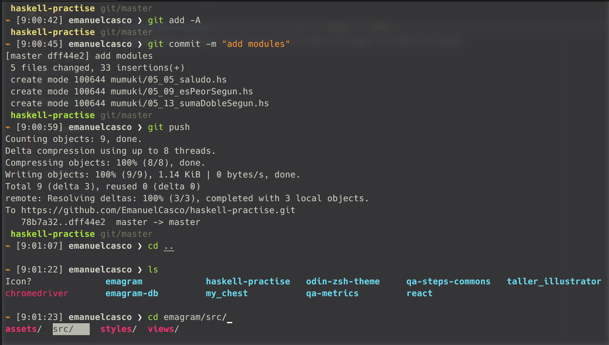

# Odín

A ZSH theme optimized for people who use:

- Solarized
- Git
- Unicode-compatible fonts and terminals (I recommend iTerm2 + Menlo)
- zsh-syntax-highlighting

> Fantastic zsh prompt for incredible people

## What does it show?

- Prompt format is: *"⌁ [hh:mm:ss] username ❯"*
- If the previous command failed the arrow will change its color to **red**
- Git status
  - Show the repository name
  - Show the branch name
  - If you have not commited change then the color of the repository name will change to yellow.

## Install

Add odin theme file to your zsh themes folder. 

That's it!

## License

MIT © [Emanuel Casco]

